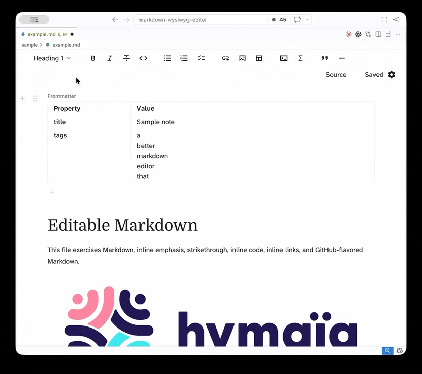

# Hymarkdown

**Notion-like editing for Markdown files.** Write visually with rich formatting, live preview, and structured editing—then save as plain Markdown. No lock-in, no proprietary formats, everything stays on your filesystem.

## Features

* **Notion-style editing** — Rich WYSIWYG interface with visual blocks, drag-to-reorder, inline formatting, and a clean toolbar

* **Frontmatter editor** — Edit YAML metadata in a structured table instead of raw text. Perfect for Agent Skills, or any frontmatter-based workflows

* **Image upload** — Drag, paste, or upload images. They're automatically copied next to your `.md` file and linked as relative paths

* **Live math & diagrams** — Render LaTeX equations and Mermaid diagrams inline as you type

* **Offline-first** — No built-in cloud. Bring your own sync solution: git, Google Drive, OneDrive, you name it

## Quick Start

1. Open any `.md` or `.markdown` file in VS Code
2. Choose your preferred way to open the editor:

   * **Command palette** (`Cmd+Shift+P`): Run `Hymarkdown: Open Editor`

   * **Explorer context menu**: Right-click a Markdown file → Select "Hymarkdown"
3. Edit visually in the rich editor
4. **Save normally** (`Cmd+S` / `Ctrl+S`)—your changes are written back to the Markdown file

That's it. The file stays as plain Markdown.

## Requirements

* VS Code 1.86+

## Built With

* [Milkdown](https://milkdown.dev/) — markdown editor framework

* [Crepe](https://crepe.js.org/) — design system and components

* [Mermaid](https://mermaid.js.org/) — diagram rendering

* [js-yaml](https://github.com/nodeca/js-yaml) — YAML parsing for frontmatter

### Built by

## License

MIT
