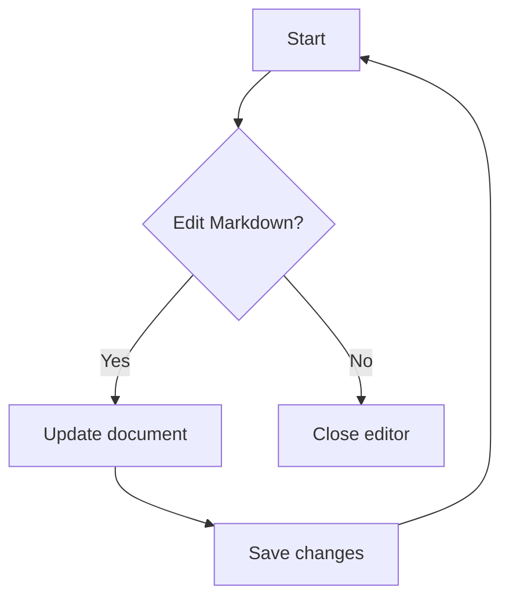

---

title: Sample note
tags:

* markdown
* wysiwyg
* toto;

---

# Editable Markdown

This file exercises **Markdown**, _inline emphasis_, ~~strikethrough~~, `inline code`, [inline links](https://code.visualstudio.com/ "https://code.visualstudio.com/"), and GitHub-flavored Markdown.

## Headings

### Heading level 3

#### Heading level 4

## Paragraphs And Line Breaks

Use a normal paragraph for prose.

End a line with two spaces for a hard break.\
This line should appear directly below the previous one.

## Blockquotes

> Frontmatter should be preserved when edits are saved.
>
> Nested quote:
>
> > This is a nested blockquote.

## Lists

* Unordered item
* Another item
  * Nested item
  * Nested item with **bold**

1. Ordered item
2. Ordered item
3. Ordered item with `code`

## GitHub Task Lists

* Render checked tasks
* Render unchecked tasks
* Preserve task list markdown when possible

## Table

| Syntax                                              |                 | Column | Example | Notes |
| --------------------------------------------------- | --------------- | ------ | ------- | ----- |
| Bold                                                |                 |        |         |       |
| **text**                                            | Strong emphasis |        |         |       |
|                                                     |                 |        |         |       |
|                                                     |                 |        |         |       |
|                                                     |                 |        |         |       |
|                                                     |                 |        |         |       |
|                                                     |                 |        |         |       |
|                                                     |                 |        |         |       |
|                                                     |                 |        |         |       |
|                                                     |                 |        |         |       |
| [label](https://example.com "https://example.com/") | Inline link     |        |         |       |
| Code                                                |                 |        |         |       |
| `` `value` ``                                       | Inline code     |        |         |       |

Use the rich editor table controls to insert rows and columns while the cursor is inside a table cell.

## Mermaid



## Math

Inline math: $E = mc^2$.

Display math:

$$
\frac{d}{dx}x^n = nx^{n-1}
$$

## Code Fences

```TypeScript
type Result = {
  ok: boolean;
  value: number;
};

const result: Result = { ok: true, value: 42 };
```

```Shell
printf 'hello markdown\n'
```

## References

This sentence uses a [reference-style link](https://code.visualstudio.com/docs/languages/markdown "https://code.visualstudio.com/docs/languages/markdown").

This sentence uses a collapsed [reference](https://github.github.com/gfm/ "https://github.github.com/gfm/").

## Images


## Autolinks

[https://github.github.com/gfm/](https://github.github.com/gfm/ "https://github.github.com/gfm/")

## HTML-Like Markdown

Markdown source can contain inline HTML in many renderers, but this editor sanitizes raw HTML by default for safety.

* [ ] Test
* [x] Unchecked

