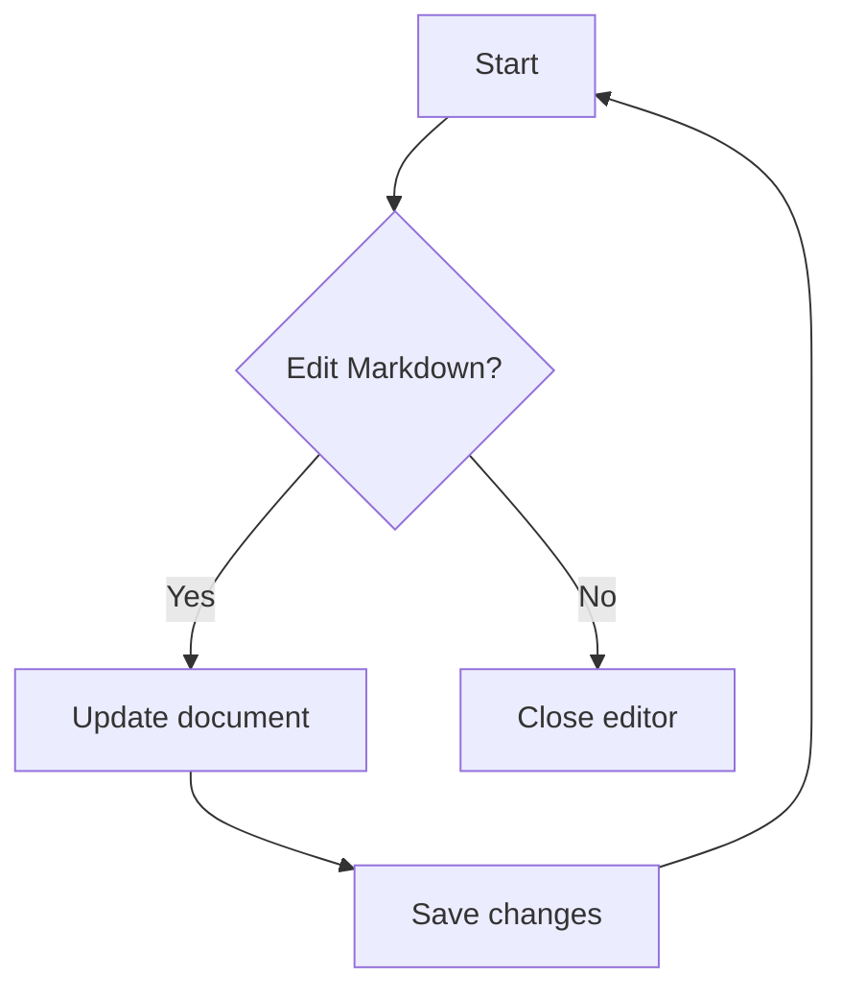

# Editable Markdown

This file exercises Markdown, inline emphasis, strikethrough, inline code, inline links, and GitHub-flavored Markdown.

## Headings

#### Heading level 4

### Heading level 3

## Paragraphs And Line Breaks

Use a normal paragraph for prose.

End a line with two spaces for a hard break.\
This line should appear directly below the previous one.

## Blockquotes

> Frontmatter should be preserved when edits are saved.
>
> Nested quote:
>
> > This is a nested blockquote.


## Lists

* Unordered item

* Another item

  * Nested item

  * Nested item with **bold**

1. Ordered item
2. Ordered item
3. Ordered item with `code`

## GitHub Task Lists

* Render checked tasks

* Render unchecked tasks

* Preserve task list markdown when possible

#### qddqsdqjk

Use the rich editor table controls to insert rows and columns while the cursor is inside a table cell.

| Item       | In Stock |  Price |
| :--------- | :------: | -----: |
| SQL Hat    |   True   |  23.99 |
| Python Hat |   True   |  23.99 |
| <br />     |  <br />  | <br /> |
| <br />     |  <br />  | <br /> |

## Mermaid



## Math

Inline math: $E = mc^2$.

Display math:

$$
\frac{d}{dx}x^n = nx^{n-1}
$$

## Code Fences

```TypeScript
type Result = {
  ok: boolean;
  value: number;
};

const result: Result = { ok: true, value: 42 };
```

```Shell
printf 'hello markdown\n'
```

## References

This sentence uses a [reference-style link](https://code.visualstudio.com/docs/languages/markdown "https://code.visualstudio.com/docs/languages/markdown").

This sentence uses a collapsed [reference](https://github.github.com/gfm/ "https://github.github.com/gfm/").

## Images


## Autolinks

[https://github.github.com/gfm/](https://github.github.com/gfm/ "https://github.github.com/gfm/")

## HTML-Like Markdown

Markdown source can contain inline HTML in many renderers, but this editor sanitizes raw HTML by default for safety.

* [ ] Test

* [x] Unchecked
